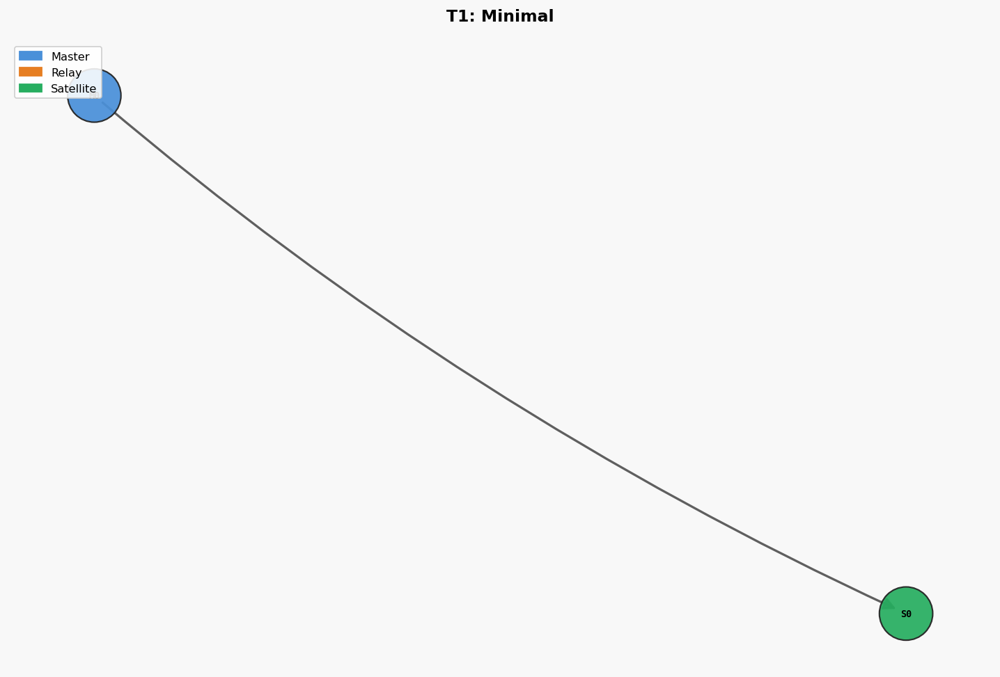
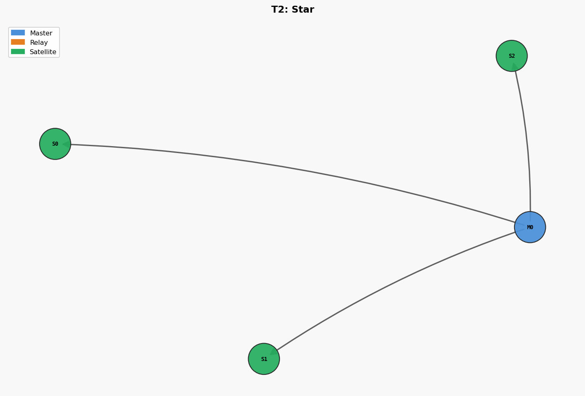
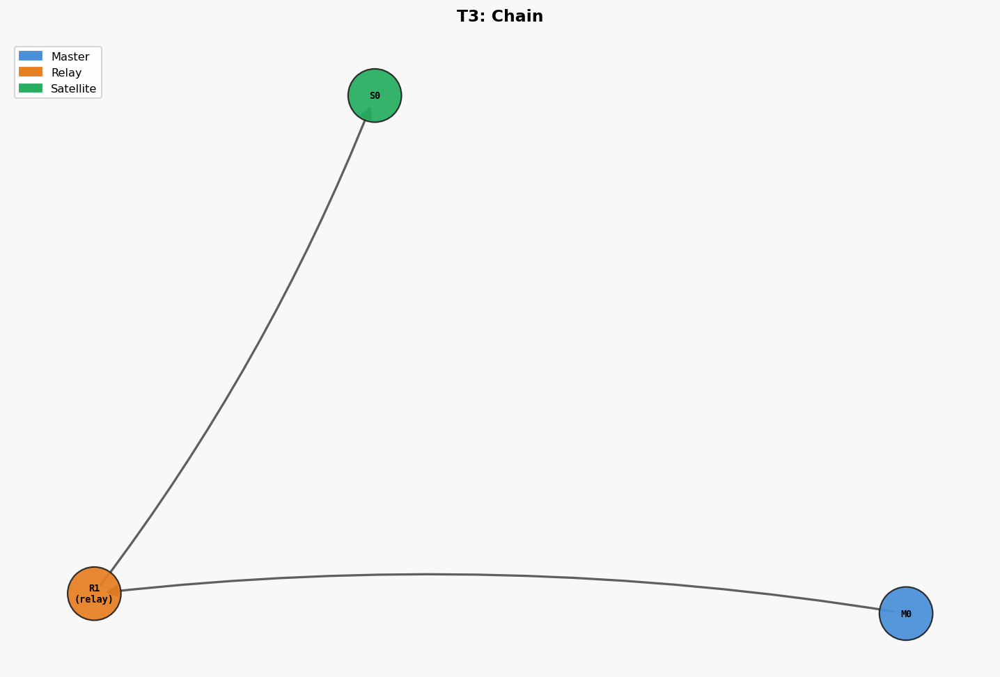
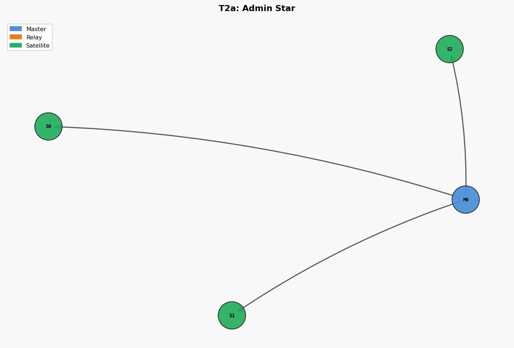
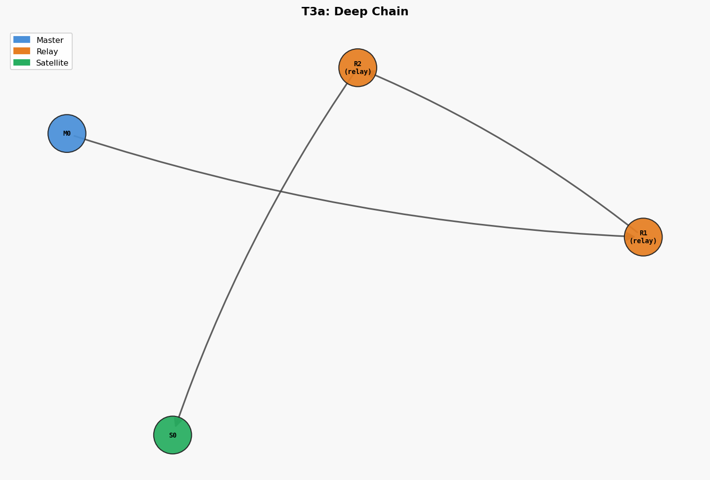
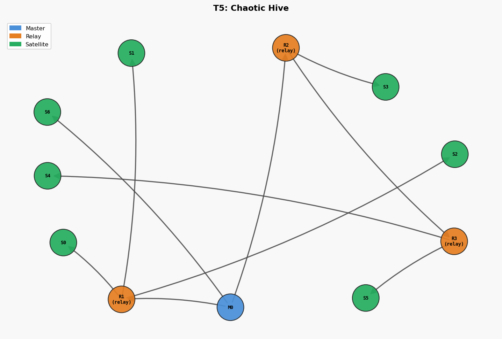
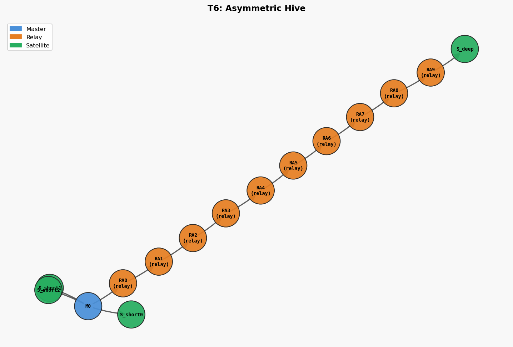

# Network Topologies

The harness must exercise the protocol across a range of realistic deployment shapes.
Each topology is defined by a fixture in `conftest.py` that assembles the nodes and
wires their connections before tests run.

---

## T1 · Minimal (1 Master, 1 Satellite)



```
M0
└── S0
```

**Purpose**: Baseline. Validates every single-hop message type in isolation.

**Parameters**: `n_satellites=1`

**Key test cases on this topology**:
- HELLO / HANDSHAKE sequence
- BUS message satellite → master
- BUS message master → satellite
- SHARED_BUS passive monitoring
- ESCALATE (nothing upstream of M0, message stays)
- BINARY all payload types

---

## T2 · Star (1 Master, N Satellites)



```
       M0
  ┌────┼────┐
  S0   S1   S2  ...  SN
```

**Purpose**: Test fan-out messages and per-client isolation.

**Parameters**: `n_satellites=3..10`

**Key test cases**:
- BROADCAST from M0 reaches all satellites
- BROADCAST attempt from S0 (non-admin) → rejected
- PROPAGATE from S0 → M0 forwards to S1, S2 … SN
- INTERCOM S0 → S2 (via M0, RSA encrypted)
- Per-satellite `msg_blacklist` — S1 blocks type X, S2 still receives it
- Session isolation — each satellite has its own session

---

## T3 · Chain (Linear Hierarchy)



```
M0
└── R1  (R1 is both satellite of M0 and master to S0)
    └── S0
```

**Purpose**: Validate multi-hop ESCALATE and PROPAGATE.

**Parameters**: `depth=3..5`

**Key test cases**:
- S0 sends ESCALATE → M1 escalates → M0 receives
- M0 sends BROADCAST → M1 forwards downstream → S0 receives
- PROPAGATE from S0 → M1 forwards to M0 and any M1 siblings
- Hop route tracking (route array grows with each hop)
- Session context preserved through chain

---

## T4 · Hierarchical Star (Tree)

```
         M0
    ┌─────┼─────┐
   M1    M2    M3
  ┌┴┐   ┌┴┐   ┌┴┐
 S0 S1 S2 S3 S4 S5
```

**Purpose**: Test that escalation reaches the root and broadcast descends fully.

**Parameters**: `depth=2, branching_factor=3`

**Key test cases**:
- S0 ESCALATE → M1 → M0 (stops; M0 has no upstream)
- M0 BROADCAST → M1, M2, M3 → S0..S5 all receive
- S0 PROPAGATE → M1 (to S1) → M0 (to M2, M3 → S2..S5)
- PING from M0 → maps entire tree
- QUERY from S0: first node that responds wins, others discarded
- `target_site_id` routing: BROADCAST with site_id="S3-site" delivered only to S3

---

## T5 · Diamond (Satellite with Two Masters)

```
  M0    M1
   \   /
    S0
```

**Purpose**: Test that a satellite connecting to two masters doesn't create loops.

**Parameters**: 2 masters, 1 shared satellite

**Key test cases**:
- S0 sends BUS to M0 and separately to M1
- ESCALATE from S0 goes to both M0 and M1
- BROADCAST from M0 reaches S0; M1's broadcast also reaches S0 (separate sessions)
- No infinite loop when M0 and M1 both propagate the same message origin

---

## T6 · Mesh (N Masters, M Satellites each)

```
M0 ─── M1
│       │
S0,S1  S2,S3
```

**Purpose**: Simulate a real multi-site deployment.

**Parameters**: `n_masters=3, n_satellites_per_master=3`

**Key test cases**:
- PROPAGATE crosses master boundaries
- ESCALATE terminates at top-level masters
- INTERCOM reaches satellite on different master
- Performance: 100 BUS messages through 3-master mesh, all delivered < 5s

---

## T7 · Single Master, High Satellite Count (Stress)

```
M0
├── S0
├── S1
├── ...
└── S49
```

**Purpose**: Validate no message is lost under load.

**Parameters**: `n_satellites=50`

**Key test cases**:
- M0 sends BROADCAST → all 50 satellites receive
- 50 satellites each send 1 BUS → M0's FakeBus receives 50 messages
- No duplicate delivery
- Timing: all messages arrive within 10s

---

## T8 · Protocol Version Mix

Same topology as T2 (star), but different nodes negotiate different protocol versions:

| Node | Protocol Version | Crypto |
|---|---|---|
| S0 | V0 (pre-shared key) | AES-GCM / JSON_HEX |
| S1 | V1 (RSA handshake) | AES-GCM / JSON_B64 |
| S2 | V2 (binary) | AES-GCM / bitstring |

**Purpose**: Ensure the master handles mixed-version clients simultaneously.

---

## T9 · Relay Node (Satellite-Master)

```
M0
└── R0  (relay: satellite of M0, master to S0, S1)
    ├── S0
    └── S1
```

**Purpose**: Test a node acting as both slave and master simultaneously
(the most common real-world HiveMind deployment with bridges/relays).

**Key test cases**:
- S0 BUS → R0 injects into M0
- M0 BROADCAST → R0 → S0, S1
- S0 ESCALATE → R0 → M0
- INTERCOM S0 → S1 (same relay, short path)
- INTERCOM S0 → satellite on different relay (crosses M0)

---

## Implemented Topology Fixtures (conftest.py)

| Fixture | Nodes | Depth | Plot |
|---|---|---|---|
| `minimal_topology` | M0 + S0 | 1 |  |
| `star_topology` | M0 + S0,S1,S2 | 1 |  |
| `admin_star_topology` | M0 + S0(admin),S1,S2 | 1 |  |
| `chain_topology` | M0 → R1 → S0 | 2 |  |
| `deep_chain_topology` | M0 → R1 → R2 → S0 | 3 |  |
| `huge_hive_topology` | M0 + 10 relays + 37 leaves | 2 | (too large for inline) |
| `chaotic_hive_topology` | M0 + 3 relays + 7 leaves | 3 |  |
| `asymmetric_hive_topology` | M0 + 10-deep chain + 3 short | 11 |  |

## Planned Topologies (no fixture yet)

| Name | Description |
|---|---|
| Diamond | Satellite with two upstream masters |
| Mesh | N masters × M satellites cross-linked |
| Stress Star | 1 master + 50+ satellites |
| Mixed Protocol | Heterogeneous protocol versions |

---
[← Protocol Coverage](02-protocol-coverage.md) · [Home](index.md) · [Test Scenarios →](04-test-scenarios.md)
